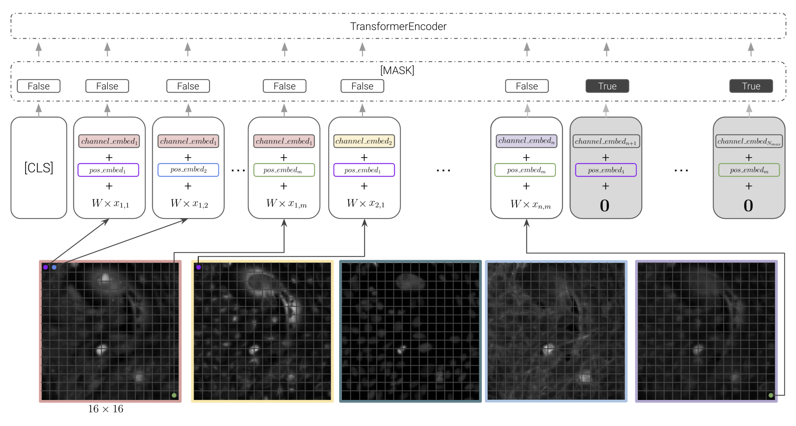
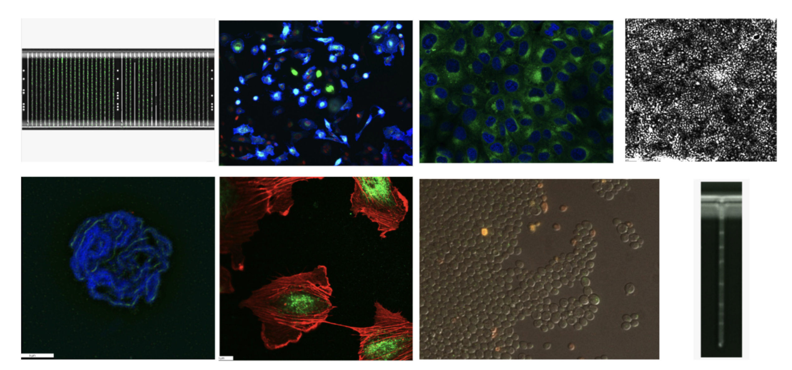
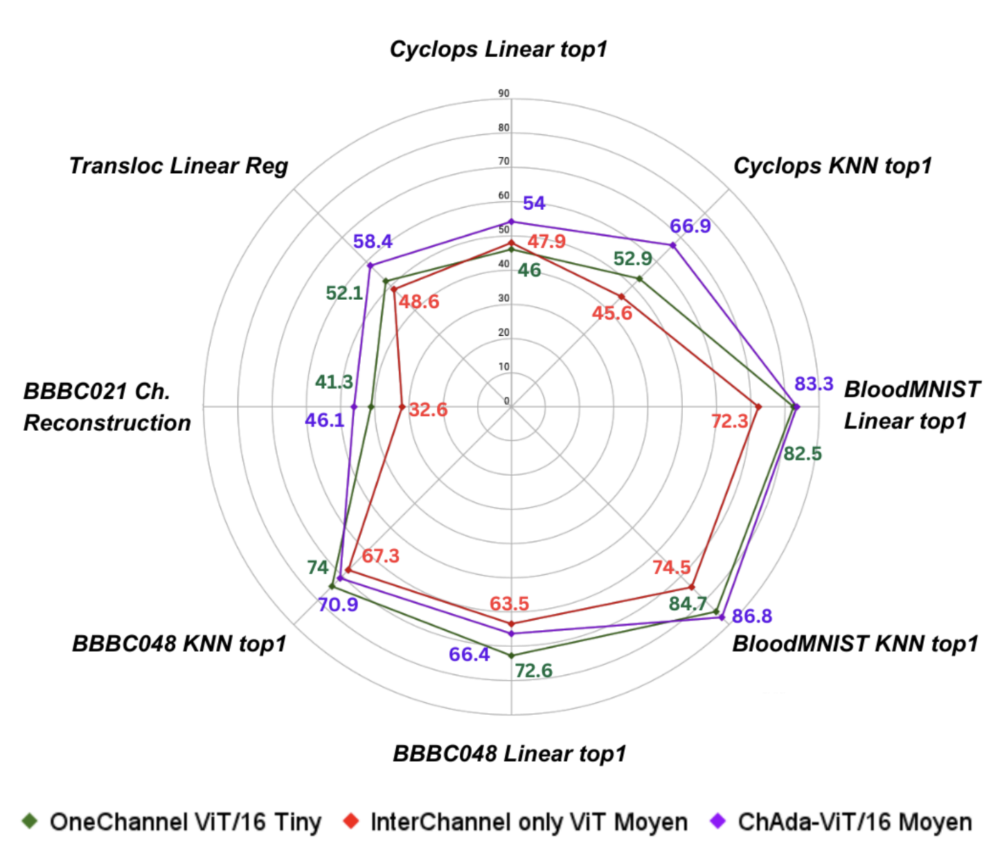
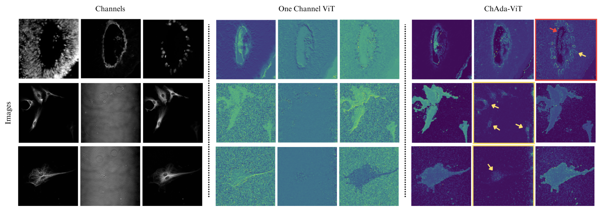
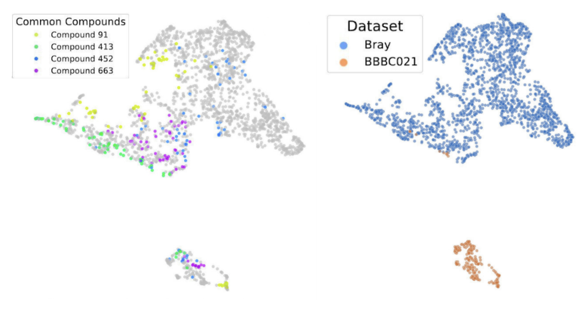

# 🧬 ChAda-ViT: Channel Adaptive Vision Transformer

[](https://opensource.org/licenses/Apache-2.0)

Official PyTorch implementation and pretrained models of ChAda-ViT. For details, see **ChAda-ViT: Channel Adaptive Attention for Joint Representation Learning of Heterogeneous Microscopy Images**
[[`arXiv`](https://arxiv.org/abs/2311.15264)]

## 🚀 Introduction

_**"How could we process images of different modalities, with different number of channels, and of different types all within one single Vision Transformer model ?"**_

**ChAda-ViT (Channel Adaptive Vision Transformer)** is meant to address a tricky challenge encountered in biological imaging: images span a variety of modalities, each with a different number, order, and type of channels, often bearing little correlation to each other. This complexity has long been a hurdle in the field.

**Our Solution:** ChAda-ViT utilizes an Inter-Channel & Inter-Channel Attention mechanism, tailored to handle images regardless of their channel diversity. This allows for the effective analysis of images from 1 to 10 channels per experiment, spanning 7 different microscope modalities.

**IDRCell100k Dataset:** Alongside ChAda-ViT, we introduce IDRCell100k, a comprehensive bioimage dataset encompassing 79 experiments coming from 7 different imaging methods. This rich resource is designed to fully leverage the capabilities of ChAda-ViT, offering an unprecedented diversity in microscopy and channel types.

**Impact:** Trained in a self-supervised manner, ChAda-ViT sets new benchmarks in biological image analysis. It not only excels in various biologically relevant tasks but also pioneers in bridging the gap across different assays. Whether it's varying microscopes, channel numbers, or types, ChAda-ViT offers a unified, powerful representation for biological images. This paves the way for enhanced interdisciplinary studies and broadens the horizon for deep learning applications in bioimage-based research.

<div align="center">
  
</div>

## 🗾 Dataset

The IDRCell100k dataset is a comprehensive collection of biological images, meticulously curated to represent a broad spectrum of microscopy techniques and channel configurations. It comprises 79 different experiments, utilizing 7 types of microscopy techniques, with images featuring channel counts ranging from 1 to 10. Each experiment contributes 1300 images, culminating in a total of 104,093 multiplexed images, each resized to 224x224 pixels. This dataset, unique in its diversity and scale, provides an invaluable resource for the development and validation of advanced image analysis models like ChAda-ViT, enhancing their capability to adapt to various imaging conditions and channel complexities in biological research.

Dataset available soon...

<div align="center">
  
</div>

## 📈 Results

This section provides a snapshot of the model's capabilities, with the paper offering a deeper dive into these groundbreaking findings.
For detailed analyses, comprehensive results, and in-depth discussions, please refer to the full paper. 

### Classic Benchmarks
ChAda-ViT exhibits exceptional performance across a range of classical biological image benchmarks. Its advanced architecture allows for precise and efficient analysis, outperforming existing models in accuracy and computational efficiency. This highlights the model's significant contribution to the field of bioimaging.

<div align="center">
  
</div>

### Visualization of Attention Maps
The model's innovative Inter-Channel Attention mechanism is visualized, demonstrating its effectiveness in focusing on crucial features within diverse channel types. These visualizations provide insights into the model's internal processing, revealing how it distinguishes and prioritizes different aspects of biological images.

<div align="center">
  
</div>

### Single Joint Embedding Space
ChAda-ViT uniquely embeds images from various modalities into a single, coherent representation space. This feature underscores the model's versatility and its ability to handle images from different microscopes, channel numbers, or types, facilitating a more unified approach in biological image analysis.

<div align="center">
  
</div>


## ⬇️ Installation

Clone the repository from Github:

```bash
git clone https://github.com/nicoboou/chada_vit.git
cd chada_vit
```

Use [Poetry](https://python-poetry.org/docs/#installation) to install the Python dependencies (via pip). This command creates an environment in a default location (in `~/.cache/pypoetry/virtualenvs/`). You can create and activate an environment, poetry will then install the dependencies in that environment:

```bash
poetry install --without dev            # Install the dependencies

POETRY_ENV=$(poetry env info --path)    # Get the path of the environment
source "$POETRY_ENV/bin/activate"       # Activate the environment
```

For the pretrained weights, stay tuned !

## 🗣️ Citation

If you find this repository useful for your research, please cite the following paper as such:

```
@article{bourriez2023chada,
  title={ChAda-ViT: Channel Adaptive Attention for Joint Representation Learning of Heterogeneous Microscopy Images},
  author={Bourriez, Nicolas and Bendidi, Ihab and Cohen, Ethan and Watkinson, Gabriel and Sanchez, Maxime and Bollot, Guillaume and Genovesio, Auguste},
  journal={arXiv preprint arXiv:2311.15264},
  year={2023}
}
```

